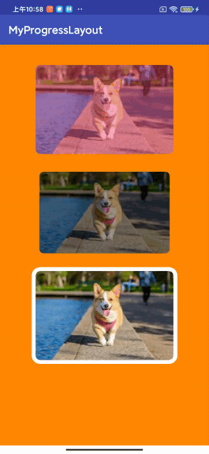

#可以控制进度的圆角外边框图片控件

#预览图


#使用方式
```
<com.example.mi.progressborderimageview.ProgressImageView
        android:layout_marginTop="30dp"
        android:id="@+id/my_progress_imageView"
        android:layout_width="275dp"
        android:layout_height="183dp"
        android:layout_centerHorizontal="true"
        android:src="@drawable/images"
        app:border_width="8dp"
        app:border_color="@android:color/holo_blue_light"
        app:need_mask="true"
        app:mask_color="@color/makeColor"
        />
```

#支持自定义边框颜色,宽度 设置当前进度 控制遮罩
|属性名|含义|默认值|对应方法
|---|---|---|---|
|border_width|边框宽度|20px|/
|border_color|边框颜色|Color.BLUE|/
|corner_radius|表框圆角半径|30px|/
|need_mask|是否需要遮罩|true|setNeedMask
|mask_color|遮罩颜色|0x66000000|/
|current_progress|当前进度|0|setProgress